# 🛫 Intelligent Flight Tracking Assistant – UML and Architecture Tactics

## UML Diagrams

### 1. Static UML Diagrams

#### A. Use Case Diagram

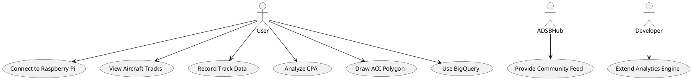

#### B. Class Diagram

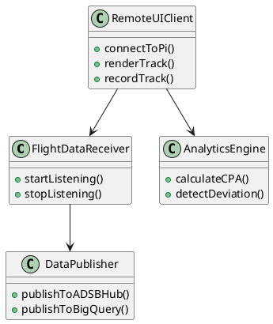

#### C. Component Diagram

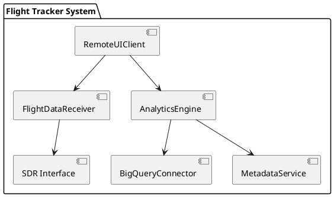

### 2. Dynamic UML Diagrams

#### A. Sequence Diagram – Connecting to Live Feed

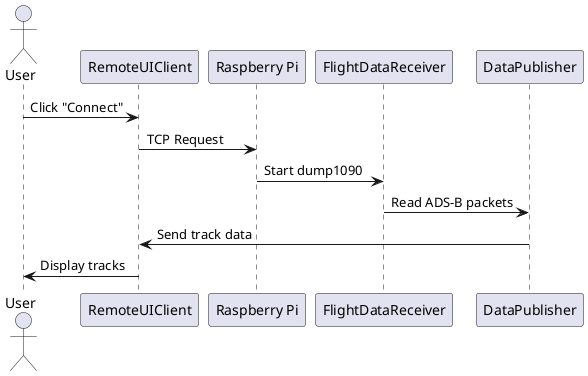

#### B. State Diagram – RemoteUIClient States

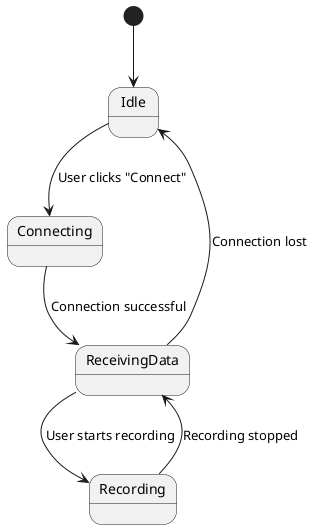

---

## Quality Attribute Approaches

### 1. Performance

#### Approach 1: Asynchronous Data Streaming

- **Source:** User  
- **Stimulus:** Clicks “Connect”  
- **Artifact:** RemoteUIClient  
- **Environment:** High aircraft traffic  
- **Response:** Starts receiving and rendering tracks without blocking UI  
- **Response Measure:** Track updates visible within 200ms  

💡 **When to use:** For smooth, real-time responsiveness with low CPU usage.

```plantuml
@startuml
actor User
participant "RemoteUIClient" as RUI
participant "Data Stream"

User -> RUI : Click "Connect"
RUI -> Data Stream : Subscribe async events
Data Stream --> RUI : Aircraft data events
RUI -> RUI : Update UI non-blocking
@enduml
```

#### Approach 2: Multi-threaded Buffering and Batch Rendering

- **Source:** User  
- **Stimulus:** Clicks “Connect”  
- **Artifact:** RemoteUIClient  
- **Environment:** High-volume data bursts  
- **Response:** Buffers data in background thread, UI updates in batches  
- **Response Measure:** UI refreshes every 500ms  

💡 **When to use:** When CPU conservation is critical, allowing slightly increased latency.

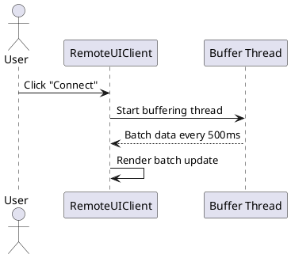

**Selected:** Approach 1 for lower CPU use and real-time responsiveness.

---

### 2. Resiliency

#### Approach 1: Auto-reconnection Logic on Network Loss

- **Source:** Network  
- **Stimulus:** Connection lost  
- **Artifact:** RemoteUIClient  
- **Environment:** Unstable wireless link  
- **Response:** Automatically retries connection every 5 seconds  
- **Response Measure:** Connection restored within 15 seconds  

💡 **When to use:** For handling transient network interruptions automatically.

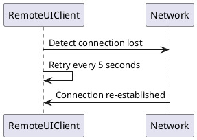

#### Approach 2: Test Data Replay via Record-Playback Mode

- **Source:** Test Engineer  
- **Stimulus:** Initiates test playback  
- **Artifact:** RemoteUIClient (or Analytics Engine)  
- **Environment:** Testing environment with recorded data  
- **Response:** Replays recorded ADS-B data streams for testing and regression  
- **Response Measure:** Accurate reproduction of previous data feeds for automated testing  

💡 **When to use:** To simulate real ADS-B feeds for automated regression tests.

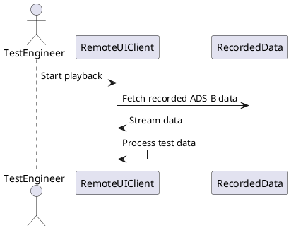

**Selected:** Approach 1 for simplicity and adequate recovery handling.

---

### 3. Extensibility

#### Approach 1: Plugin-based Feature Modules

- **Source:** Developer  
- **Stimulus:** Adds new feature plugin  
- **Artifact:** System core and plugin modules  
- **Environment:** Development or runtime  
- **Response:** Dynamically loads and integrates new features without changing core system  
- **Response Measure:** New features available immediately with minimal system impact  

💡 **When to use:** For easy addition of optional or third-party features.

```plantuml
@startuml
actor Developer
package "Core System" {
  class PluginManager {
    +loadPlugin()
  }
}
package "Plugins" {
  class AnalyticsPlugin
  class MapLayerPlugin
}

Developer -> PluginManager : Add new plugin
PluginManager --> AnalyticsPlugin : Load
PluginManager --> MapLayerPlugin : Load
@enduml
```

#### Approach 2: Event-driven Architecture with Signal Slots

- **Source:** System Components  
- **Stimulus:** Event occurrence (e.g., data update)  
- **Artifact:** Event bus or signal-slot mechanism  
- **Environment:** Runtime system with multiple interacting modules  
- **Response:** Components react to events asynchronously via connected slots  
- **Response Measure:** Decoupled, flexible communication between modules  

💡 **When to use:** For loose coupling and dynamic interaction among components.

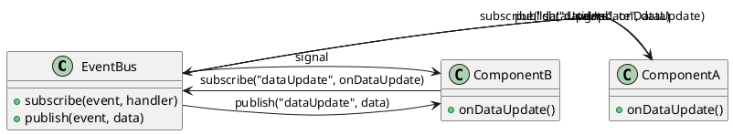

**Selected:** Approach 1 for adding optional modules like new analytics tools.

---

### 4. Modifiability

#### Approach 1: Dependency Injection for Map Service

- **Source:** Developer  
- **Stimulus:** Request to modify or replace map service  
- **Artifact:** Map service interface and client components  
- **Environment:** Runtime or development  
- **Response:** Injects different map service implementations without changing client code  
- **Response Measure:** Changes applied with minimal code impact and improved testability  

💡 **When to use:** To increase flexibility and ease testing by decoupling components.

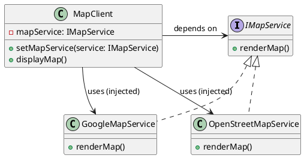

#### Approach 2: Isolate UI Components with Clear Interfaces

- **Source:** Developer  
- **Stimulus:** Requirement to modify UI without affecting other parts  
- **Artifact:** UI components with defined interfaces  
- **Environment:** Runtime or development  
- **Response:** Changes confined to isolated components, minimizing ripple effects  
- **Response Measure:** Reduced code impact and improved maintainability  

💡 **When to use:** To simplify maintenance and enable parallel development.

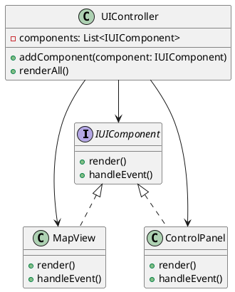

**Selected:** Approach 2 for minimal code impact and high maintainability.

---

### 5. Usability

#### Approach 1: Context-sensitive Help and UI Tooltips

- **Source:** User  
- **Stimulus:** User hovers over or requests help on UI element  
- **Artifact:** User Interface  
- **Environment:** Interactive runtime  
- **Response:** Displays relevant help text or tooltip near the UI element  
- **Response Measure:** Improved user guidance and reduced errors  

💡 **When to use:** To provide immediate, targeted assistance without disrupting workflow.

```plantuml
@startuml
actor User
class UIElement {
  +showTooltip()
  +displayHelp()
}

User -> UIElement : Hover or click help
UIElement -> UIElement : Show tooltip/help text
@enduml
```

#### Approach 2: Step-by-step Onboarding Walkthrough

- **Source:** New User  
- **Stimulus:** First-time use or onboarding request  
- **Artifact:** User Interface / Onboarding Module  
- **Environment:** Initial user interaction  
- **Response:** Guides user through key features with sequential steps  
- **Response Measure:** Increased user proficiency and reduced confusion  

💡 **When to use:** To help new users quickly learn system features.

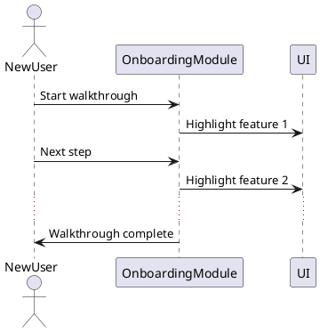

**Selected:** Approach 2 to better support training goals of FAA students.

---

### 6. Security

#### Approach 1: Whitelisted IP Filtering on Raspberry Pi TCP Port

- **Source:** Network connection attempt  
- **Stimulus:** Incoming TCP connection request  
- **Artifact:** Raspberry Pi TCP server  
- **Environment:** Local network or controlled environment  
- **Response:** Accepts connection only if IP is on whitelist; rejects otherwise  
- **Response Measure:** Unauthorized connections blocked immediately  

💡 **When to use:** In controlled or offline environments for basic security.

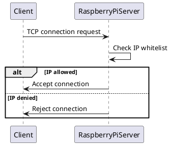

#### Approach 2: Encrypt TCP Stream with TLS

- **Source:** Network connection attempt  
- **Stimulus:** Client initiates TCP connection  
- **Artifact:** Raspberry Pi TCP server with TLS enabled  
- **Environment:** Potentially insecure or public network  
- **Response:** Establishes encrypted TLS session before data exchange  
- **Response Measure:** Data confidentiality and integrity ensured  

💡 **When to use:** Over untrusted networks to protect data.

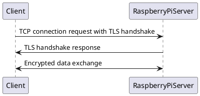

**Selected:** Approach 1 for local offline operation where encryption overhead isn't needed.

---

### 7. Reliability

#### Approach 1: Persistent Queues to Store Last N Data Points

- **Source:** Data input stream  
- **Stimulus:** Incoming flight data packets  
- **Artifact:** Persistent queue storage  
- **Environment:** Normal runtime  
- **Response:** Stores last N data points reliably for recovery or replay  
- **Response Measure:** Data loss minimized, recovery time reduced  

💡 **When to use:** When data durability is critical.

```plantuml
@startuml
class DataQueue {
  -queue: List<DataPoint>
  +enqueue(data: DataPoint)
  +dequeue(): DataPoint
  +persist()
}

participant FlightDataReceiver
participant DataQueue

FlightDataReceiver -> DataQueue : enqueue(newData)
DataQueue -> DataQueue : persist data
@enduml
```

#### Approach 2: Monitor and Restart Crashed Modules Automatically

- **Source:** System Monitor  
- **Stimulus:** Detection of module crash or failure  
- **Artifact:** Flight tracking system modules  
- **Environment:** Production runtime  
- **Response:** Automatically restarts the failed module to restore service  
- **Response Measure:** Downtime minimized, service availability maintained  

💡 **When to use:** For high availability with minimal manual intervention.

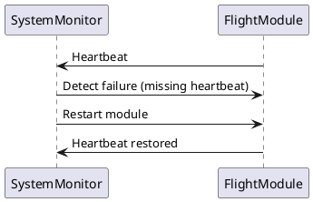

**Selected:** Approach 2 for recovering from critical failures without human input.

---

### 8. Scalability

#### Approach 1: Stream Throttling and Level-of-Detail Rendering

- **Source:** Data Stream  
- **Stimulus:** High volume of incoming aircraft data  
- **Artifact:** Flight visualization system  
- **Environment:** Resource-constrained devices (e.g., Raspberry Pi)  
- **Response:** Throttles data rate and reduces detail for distant or less important tracks  
- **Response Measure:** Maintains smooth UI performance under load  

💡 **When to use:** When system resources are limited and real-time visualization must remain responsive.

```plantuml
@startuml
class DataThrottler {
  +throttle(stream)
}

class LODRenderer {
  +render(track, detailLevel)
}

participant DataStream
participant VisualizationSystem

DataStream -> DataThrottler : Incoming data
DataThrottler -> LODRenderer : Filtered data
LODRenderer -> VisualizationSystem : Render tracks
@enduml
```

#### Approach 2: Cloud-based Processing Before Visualization

- **Source:** Flight data stream  
- **Stimulus:** Continuous flow of ADS-B data  
- **Artifact:** Cloud processing services and visualization client  
- **Environment:** Network-connected systems with cloud access  
- **Response:** Processes and aggregates data in the cloud, then sends optimized data to clients  
- **Response Measure:** Offloads heavy computation, improves scalability and responsiveness  

💡 **When to use:** When local device resources are insufficient and reliable network connectivity is available.

```plantuml
@startuml
participant DataSource
participant CloudProcessor
participant VisualizationClient

DataSource -> CloudProcessor : Send raw ADS-B data
CloudProcessor -> CloudProcessor : Aggregate and process data
CloudProcessor -> VisualizationClient : Send optimized data
VisualizationClient -> User : Render flight tracks
@enduml
```

**Selected:** Approach 1 for working within limited Raspberry Pi and laptop constraints.

---

### 9. Testability

#### Approach 1: Modularize Features with Stubs and Mocks

- **Source:** Developer or Test Framework  
- **Stimulus:** Initiates unit or integration tests  
- **Artifact:** System modules with dependencies replaced by stubs/mocks  
- **Environment:** Testing environment  
- **Response:** Allows isolated testing of components without real dependencies  
- **Response Measure:** Improved test coverage and faster test execution  

💡 **When to use:** To simplify testing by isolating modules and controlling test inputs and outputs.

```plantuml
@startuml
class ModuleUnderTest {
  +execute()
}

class StubDependency {
  +simulateResponse()
}

ModuleUnderTest --> StubDependency : depends on

TestFramework -> ModuleUnderTest : Run test with StubDependency
@enduml
```

#### Approach 2: Test Data Replay via Record-Playback Mode

- **Source:** Recorded test data  
- **Stimulus:** Initiation of playback mode during testing  
- **Artifact:** Test harness and recorded ADS-B data streams  
- **Environment:** Testing or development  
- **Response:** Replays recorded data to simulate real system inputs  
- **Response Measure:** Enables consistent and repeatable test scenarios  

💡 **When to use:** To automate regression testing and validate system behavior against real-world data.

```plantuml
@startuml
class TestDataRecorder {
  +record()
  +playback()
}

class SystemUnderTest {
  +processData()
}

TestDataRecorder -> SystemUnderTest : playback recorded data
SystemUnderTest -> TestDataRecorder : process during playback
@enduml
```

**Selected:** Approach 2 to simulate real ADS-B feeds and automate regression tests.
